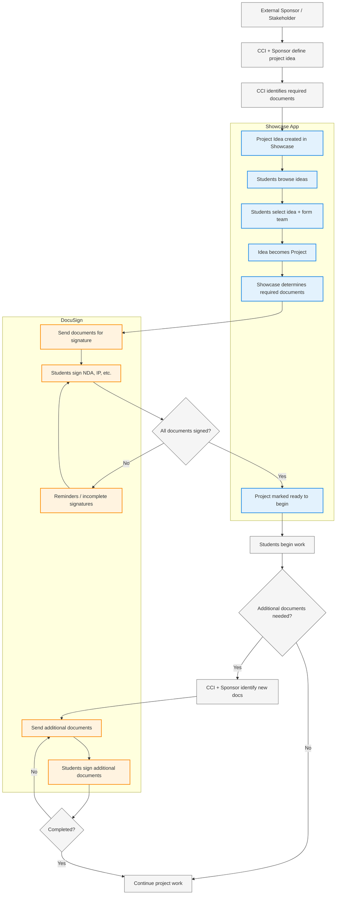
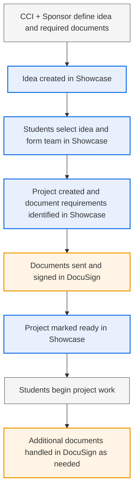

External Stakeholder Project Workflow

```mermaid
flowchart TD

%% --- External / Process ---
A[External Sponsor / Stakeholder] --> B[CCI + Sponsor define project idea]
B --> C[CCI identifies required documents]

%% --- Showcase Lane ---
subgraph Showcase App
    D[Project Idea created in Showcase]
    E[Students browse ideas]
    F[Students select idea + form team]
    G[Idea becomes Project]
    H[Showcase determines required documents]
    M[Project marked ready to begin]
end

%% --- DocuSign Lane ---
subgraph DocuSign
    I[Send documents for signature]
    J[Students sign NDA, IP, etc.]
    L[Reminders / incomplete signatures]
    R[Send additional documents]
    S[Students sign additional documents]
end

%% --- Flow ---
C --> D
D --> E --> F --> G --> H
H --> I
I --> J
J --> K{All documents signed?}

K -- No --> L --> J
K -- Yes --> M --> N[Students begin work]

N --> O{Additional documents needed?}
O -- No --> P[Continue project work]
O -- Yes --> Q[CCI + Sponsor identify new docs] --> R --> S --> T{Completed?}
T -- No --> R
T -- Yes --> P

%% --- Styling ---
classDef showcase fill:#e3f2fd,stroke:#1e88e5,stroke-width:2px;
classDef docusign fill:#fff3e0,stroke:#fb8c00,stroke-width:2px;
classDef external fill:#f5f5f5,stroke:#616161,stroke-width:1px;

class D,E,F,G,H,M showcase;
class I,J,L,R,S docusign;
class A,B,C,N,O,P,Q,T,K external;
```

```mermaid
flowchart TD

A[CCI + Sponsor define idea and required documents] --> B[Idea created in Showcase]
B --> C[Students select idea and form team in Showcase]
C --> D[Project created and document requirements identified in Showcase]
D --> E[Documents sent and signed in DocuSign]
E --> F[Project marked ready in Showcase]
F --> G[Students begin project work]
G --> H[Additional documents handled in DocuSign as needed]

classDef showcase fill:#e8f0fe,stroke:#1a73e8,stroke-width:2px;
classDef docusign fill:#fff4e5,stroke:#f29900,stroke-width:2px;
classDef external fill:#f5f5f5,stroke:#666,stroke-width:1px;

class B,C,D,F showcase;
class E,H docusign;
class A,G external;
```

